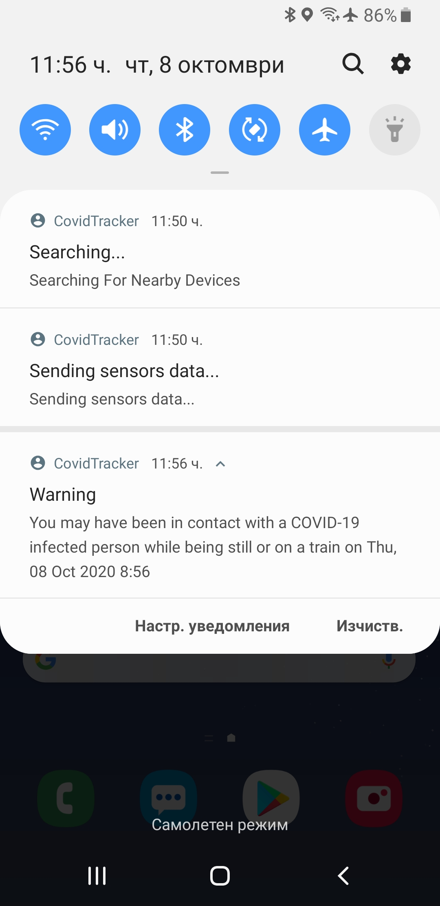

# CovidTracker

Mobile application, which helps people know if they are COVID-19 infected before they show symptoms. Every minute every device makes a Bluetooth request to every other device nearby. Via ML we know which mode of transportation every user uses - car, still, walking, bus or train. If a user marks themselves as COVID-19 infected, we send notifications to every other user, who may have been have had contact with them. Every notification contains a map, which displays the exact point, where the user has been infected as well as is what circumstance have they been infected.

## Installation

### Requirements

- Java 8
- Android SDK 30
- Gradle
- Android Studio or equivalent
- Node 14.x.x
- NPM / Yarn
- Python 3.6
- Poetry

### Running

- To run the mobile app create a configuration for Android app, choose MainActivity to be the default one, build it and run it
- To run the server create `.env` file with the fields from `.env.example`, run `yarn install` and `yarn start`
- To run the server determining the transportation mode first you need to run `poetry install` then `python3 server.py`

## Authors

- **Samuil Georgiev** - Android
- **Valentin Spasov** - Android
- **Anton Yanchev** - Backend
- **Ognian Baruh** - Backend
- **Victor Gorchilov** - Machine Learning
